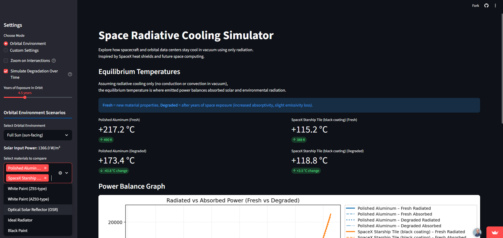
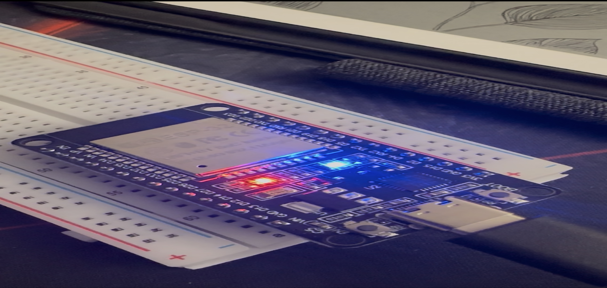
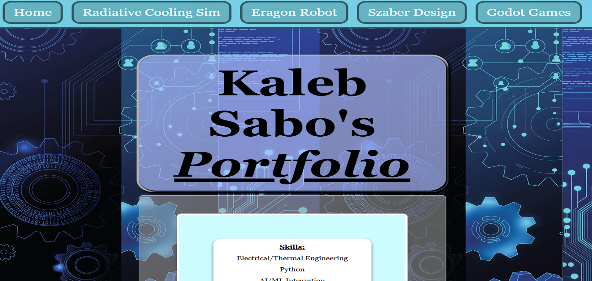

  

### 🔥 Featured Projects

<table>
  <tr>
    <td align="center">
        
       <strong>Radiative Cooling Simulator</strong> Physics-based TPS modeling • Streamlit live demo
    </td>
      <td align="center">
        
       <strong>Project Eragon</strong>  Bipedal Robot
    </td>
  </tr>
  <tr>
    <td align="center">
      
       <strong>Portfolio Site</strong> Source for kalebsabo.com • Showcases all projects
    </td>
  </tr>
</table>

<h1 align="center">Kaleb Sabo</h1>

  <strong>Percussive maintainer • Engineer • Maker • Game Dev • Space Enthusiast</strong> 
  Building robots, simulations, and games that (hopefully) don't explode 🚀🤖🎮

  
  
  
  

---

### 🚀 What I'm up to right now
- Simulating **radiative cooling** for reusable heat shields, live demo!
- Walking biped robots built mostly from 3D prints and servos
- Godot game prototypes and interactive simulations
- Learning low-level ML by training tiny transformers from scratch
- Quantum Key Distribution (QKD) CubeSat Mockup

Always down to talk shop — robotics, thermal protection, Godot, or why duct tape is a valid engineering material.

---

Check out my full portfolio at **[kalebsabo.com](https://kalebsabo.com)**

---

  
  
  
  

More: Streamlit, Blender, FreeCAD, C++, Markdown

---

### 📊 GitHub Stats

  

  

 

---

  

