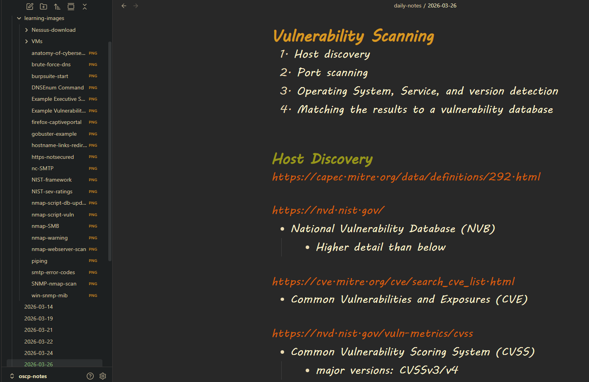

  

### Expect longer downtime until June due to OSCP study!

### 🔥 Featured Projects
<table align="center">
  <tr align="center">
    <td>
      
     <strong>OSCP</strong> Offensive Cybersecurity research
    </td>
  </tr>
  <tr>
    <td align="center">
        
       <strong>Radiative Cooling Sim</strong> Physics-based TPS modeling • Streamlit live demo
    </td>
      <td align="center">
        
       <strong>Project Eragon</strong>  Bipedal Robot (Left Leg Mk1)
    </td>
  </tr>
  <tr>
    <td align="center">
      
       <strong>Portfolio Site</strong> Source for kalebsabo.com • Showcases all projects
    </td>
    <td align="center">
      
       <strong>Heat Diffusion Sim</strong> Heat Diffusion Sim • Matrix/Numpy project
    </td>
  </tr>
</table>

<h1 align="center">Kaleb Sabo</h1>

  <strong>Percussive maintainer • Security Researcher • Robotics Maker • Game Dev</strong> 
Bridging the gap between physical hardware, autonomous agents, and secure systems. 

  
  
  
  

---

### 🚀 What I'm up to right now
🛡️ **Cybersecurity**: Currently grinding for the OSCP and developing a vulnerability assessment framework.

🤖 **AI Agents**: Building autonomous agents and exploring space-hardened compute solutions.

🛰️ **Space Tech**: Mocking up a Quantum Key Distribution (QKD) CubeSat and simulating radiative cooling.

🚶 **Robotics**: Refining Project Eragon, a bipedal robot built on ESP32/Pi and 3D-printed parts.

---

Check out my full portfolio at **[kalebsabo.com](https://kalebsabo.com)**

---

  
  
  
  

More: Streamlit, Blender, FreeCAD, C++, Markdown, Network Security

Currently Learning: Quantum Gravity, Low-level ML

---

### 📊 GitHub Stats

  

  

 

---

  

