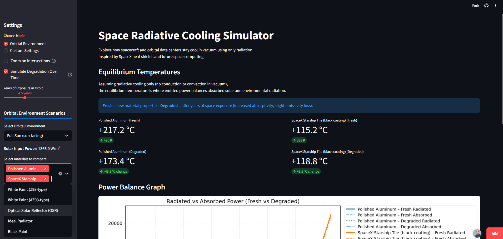
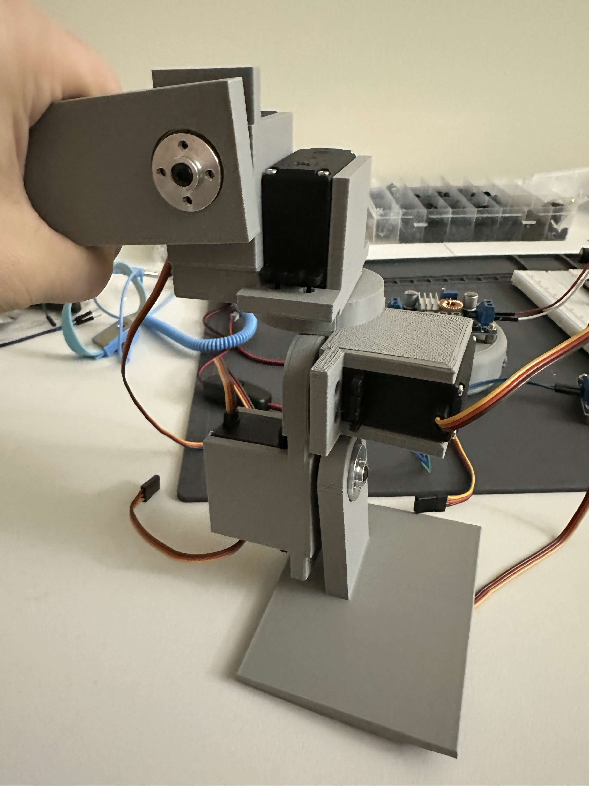
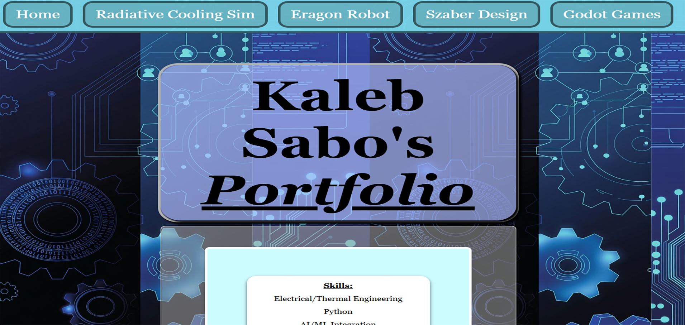
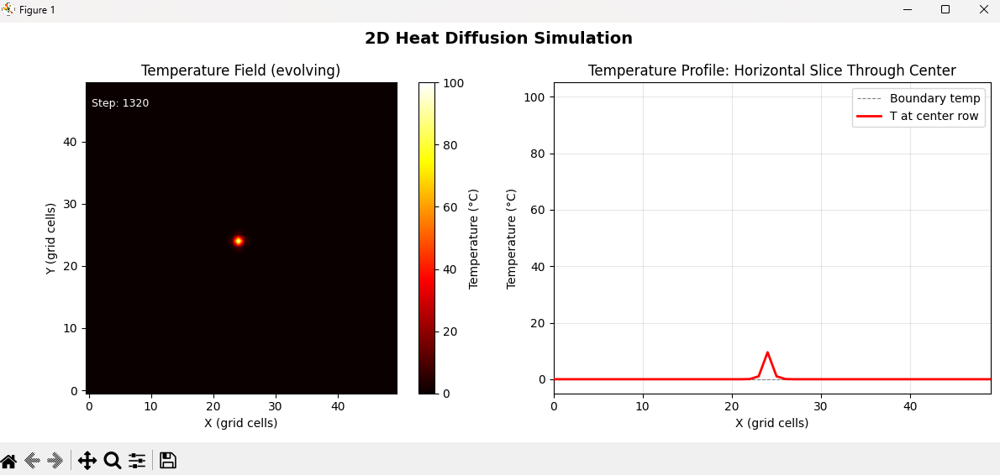

  

### 🔥 Featured Projects
<table align="center">
  <tr>
    <td align="center">
        
       <strong>Radiative Cooling Sim</strong> Physics-based TPS modeling • Streamlit live demo
    </td>
      <td align="center">
        
       <strong>Project Eragon</strong>  Bipedal Robot (Left Leg Mk1)
    </td>
  </tr>
  <tr>
    <td align="center">
      
       <strong>Portfolio Site</strong> Source for kalebsabo.com • Showcases all projects
    </td>
    <td align="center">
      
       <strong>Heat Diffusion Sim</strong> Heat Diffusion Sim • Matrix/Numpy project
    </td>
  </tr>
  <tr>
    <td align="center">
      
       <strong>Voice to VectorDB</strong> A Machine Learning Project
    </td>
  </tr>
</table>

### Hi there 👋 I'm Kaleb Sabo

**Percussive maintainer • Security Researcher • Maker • Autonomous Systems Engineer**

---

### 🛠️ Tech Stack & Toolkit
* **Languages:** C++, Python, Bash
* **Embedded & Robotics:** ESP32, FreeRTOS, ROS2, Micro-ROS
* **Engineering & CAD:** FreeCAD, KiCad, 3D Fabrication
* **Infrastructure & Security:** Linux, Docker, Git, CompTIA Security+

---

### 🚀 What I'm Working On
* **Eragon (Bipedal Robot):** Building a custom bipedal robot from scratch—handling everything from mechanical CAD modeling and PCB design to ROS2 integration and custom ESP32 firmware.
* **Infrastructure & Automation:** Developing internal deployment scripts and scaling local testing environments.

📫 **Reach out:** 
* Portfolio: [kalebsabo.com](https://kalebsabo.com)
* Engineering Portfolio: [SzaberDesign.com](https://SzaberDesign.com)
* LinkedIn: [in/kalebsabo](https://www.linkedin.com/in/kalebsabo)

---

